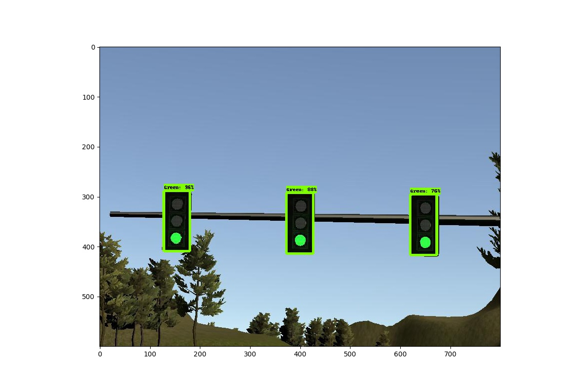
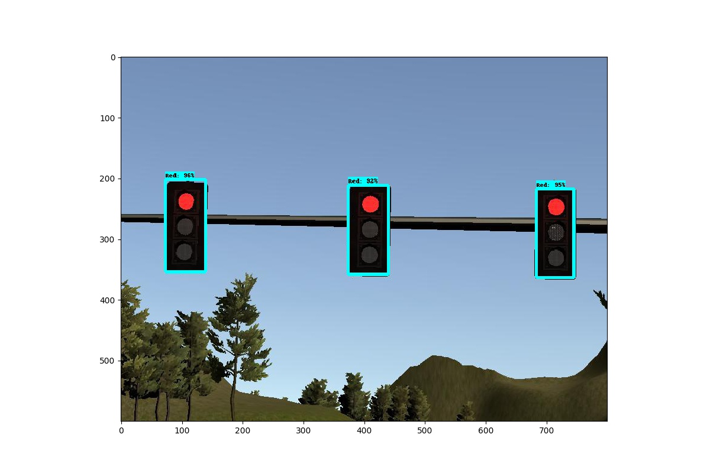
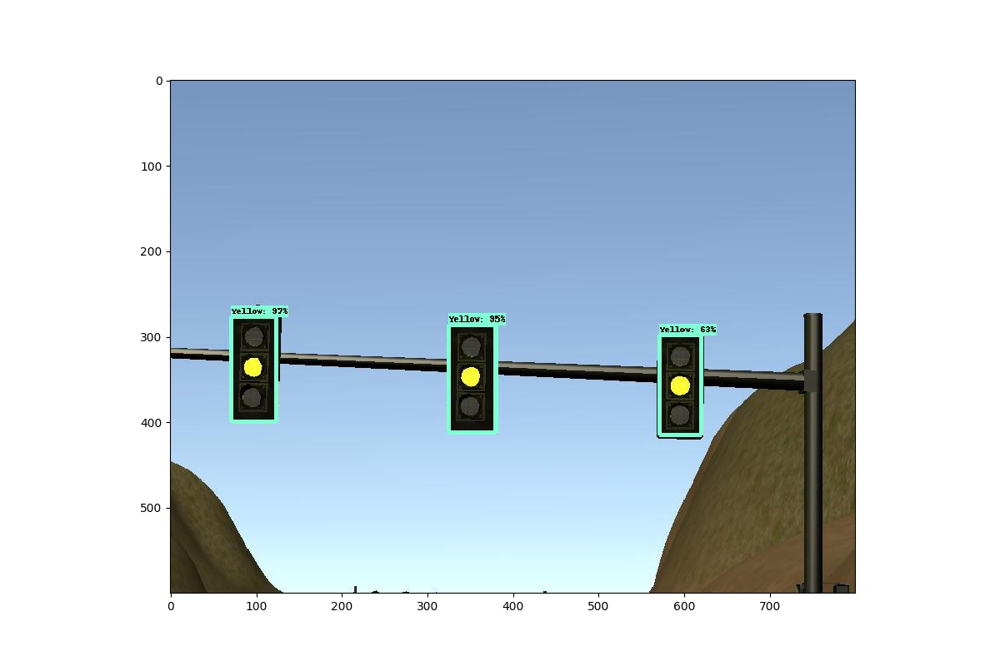

### a SSD traffic light detector by using TensorFlow model API

we use  [COCO pre-trained network](https://github.com/tensorflow/models/blob/master/research/object_detection/g3doc/detection_model_zoo.md) models (ssd_inception_v2_coco)

There are some test output images from simulator:

**NOTE:** 

The Udacity Capstone request use 1.3.0 version of TensorFlow, you can use the older version models API to train your dataset.

Ref:

1. [Self Driving Vehicles: Traffic Light Detection and Classification with TensorFlow Object Detection API][1]
2. [TensorFlow Model API][2]

[1]: https://becominghuman.ai/traffic-light-detection-tensorflow-api-c75fdbadac62
[2]: https://github.com/tensorflow/models